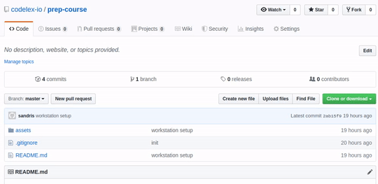

# PrepCourse | [CODELEX](https://codelex.io)

## Prerequisites 

We assume that you have already done some coding [@codecademy.com](https://www.codecademy.com), but to better understand what we are going to do - take a look at these free resources:

 - [TypeScript fundamentals @udemy.com](https://www.udemy.com/course/typescript-fundamentals)
 - [TypeScript handbook @typescriptlang.org](https://www.typescriptlang.org/docs/handbook/basic-types.html)
 - [get started with npm @youtube.com/npm](https://www.youtube.com/watch?v=x03fjb2VlGY)
 - also there is a longer TypeScript tutorial [Intro to TypeScript @scrimba.com](https://scrimba.com/g/gintrototypescript)

Create accounts, which we may be using during the course:

 - [@github.com](http://github.com)
 - [@codingame.com](http://codingame.com), choose **CODELEX** as your school

### Work Station Setup

:loudspeaker: **NEW!** The quickest way to get started is by following [this link](https://gitpod.io/#https://github.com/codelex-io/prep-course). Use your [GitHub](http://github.com) account to log in, and you are done! No installations, no setup - just follow the instructions for each set of exercises listed at the bottom of this page and start coding!  Keep in mind that each time you click on that link, a new workspace will be created, so you need to do this only once. To return to your workspace and continue your work from where you left off, go to [gitpod.io/workspaces](https://gitpod.io/workspaces).

If, however, you would like to work locally on your computer instead of the cloud, you will need to set up your computer first.  

Carefully execute all of the steps mentioned in [Work Station Setup](./work-station-setup.md) guide. Make sure that you have everything installed and verified.
 
Everything we will need is in this repository (*repository* is like a project in Git), but to get it on your computer you must clone (make a local copy) it. To do that copy the link of this repository:

Steps are as follows:

 - open Command Line
 - navigate to the folder you would like to have this project; you can use command `cd` to change the current directory
 - clone the project: `git clone https://github.com/codelex-io/prep-course.git`
 - open repository as a folder in Visual Studio Code

### ⭐ Star This Repository ⭐

When you have created a profile in [@github.com](http://github.com), leave a star.

You will receive a notification when this repository is updated, and it may serve as a thank you as well!

## Update Repository

This repository may be updated by us, which means you may have an outdated version locally.

Open terminal, navigate to the project directory and execute this command: `git pull`

## Exercises

### [Warm Up](./exercises/00-warm-up)

### [Easy](./exercises/01-easy)

### [Mini Projects](./exercises/02-mini-projects)

## Resources

 - [JavaScript documentation @mozilla.org](https://developer.mozilla.org/en-US/docs/Web/JavaScript/Index)
 - [TypeScript Playground @typescriptlang.org](http://www.typescriptlang.org/play/)
