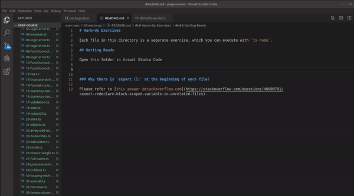

# Warm-Up Exercises

Each file in this directory is a separate exercise, which you can execute with `ts-node`.

## Getting Ready

Open this folder in Visual Studio Code

**NB!** If you are using Visual Studio Code in your browser, click on *File -> Open Workspace...* to navigate to _00-warm-up_ folder.

Now open terminal inside the editor (or command line if you prefer) by going to *Terminal* > *New Terminal*

And type in `npm install` to download all the needed packages.

## Executing Code

In the `src` directory are many code puzzles which you need to solve.

Start in ascending order, read the description and execute each file using terminal command `npm run ts src/put-file-name-here.ts`, e.g. `npm run ts src/00-hello-world.ts`

As you probably know - developers are very lazy, so here are some tips to speed up your command line skills:

 - to execute previous command press `up` key
 - start typing `npm run ts src/00` and press `tab` key, it will autocomplete with full file name

### Why there is `export {};` at the beginning of each file?

Please refer to [this answer @stackoverflow.com](https://stackoverflow.com/questions/40900791/cannot-redeclare-block-scoped-variable-in-unrelated-files).