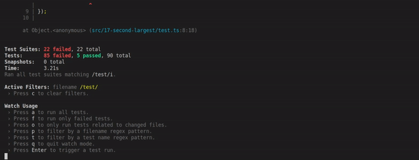
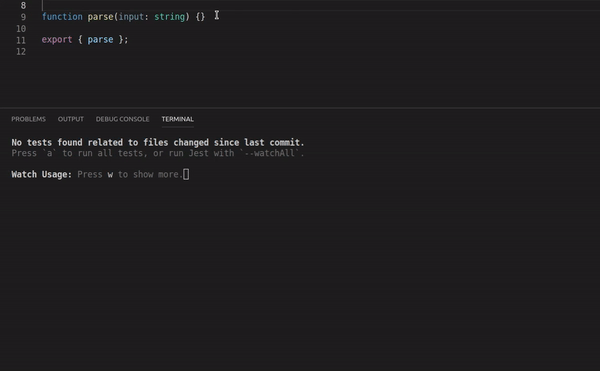

# Easy Exercises

Probably most of the *Warm Up* exercises are finished if you have managed to get this far.

Have you noticed that it is pretty cumbersome to check output all the time? If the same approach would be used in real life, development speed would suffer.

Luckily there is a better way - tests!

 > No one else should write tests for your code!!! Your code - your responsibility!

But only this time - tests are written by us, using a highly popular library - [Jest](https://jestjs.io).

Your goal for this part is to have all of the tests green.

## Getting Ready

As before, open this folder in the Visual Studio Code and download all the dependencies by executing `npm install`

## Executing Tests

`src` directory includes multiple subdirectories. Each of them contains two files, one contains the code that you are going to modify and the second one is a test file which you are not allowed to modify.

Start in the ascending order, by looking at the **code and test** (it is very important to read the test also) try to figure out what you need to do.

Execute all tests with command `npm test`

You will see that there are a lot of tests being run and most of them are failing (red).

Afterwards, the process will stay running and you will be presented with a few options, choose `o` to run only the tests related to changed files.

Now when you change any file, tests related to that file will be run (it will happen automatically, if you have autosave enabled).

If you want to exit from currently running process press `ctrl + c`.