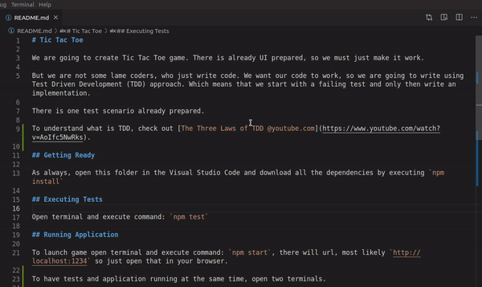

# Tic Tac Toe

We are going to create Tic Tac Toe game. There is already UI prepared, so we must just make it work.

But we are not some lame coders, who just write code. We want our code to work, so we are going to write using Test Driven Development (TDD) approach. Which means that we start with a failing test and only then write an implementation.

There is one test scenario already prepared.

To understand what is TDD, check out [The Three Laws of TDD @youtube.com](https://www.youtube.com/watch?v=AoIfc5NwRks)

## Getting Ready

As always, open this folder in the Visual Studio Code and download all the dependencies by executing `npm install`

## Executing Tests

Open terminal and execute command: `npm test`

## Running Application

To launch game open terminal and execute command: `npm start`, there will url, most likely `http://localhost:1234` so just open that in your browser.

To have tests and application running at the same time, open two terminals.

## Game Rules

- a game is over when all fields in a row are taken by a player
- players take turns taking fields until the game is over
- a game is over when all fields in a diagonal are taken by a player
- a game is over when all fields are taken
- there are two players in the game (X and O)
- a game has nine fields in a 3x3 grid
- a game is over when all fields in a column are taken by a player
- a player can take a field if it is not already taken