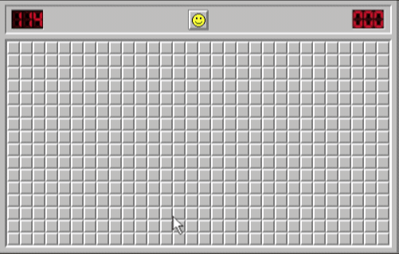

# Minesweeper 💣💣

Our goal is to create a working minesweeper game, by finishing `Minesweeper.ts` alongside with the tests.

## Getting Ready

As always, open this folder in the Visual Studio Code and download all the dependencies by executing `npm install`

## Executing Tests

Open terminal and execute command: `npm test`

## Running Application

To launch game open terminal and execute command: `npm start`, there will url, most likely `http://localhost:1234` so just open that in your browser.

## Game Rules

- game is won when all of the cells are open except the mined ones
- user can mark closed cell with flag / question mark
- user can select multiple levels of the game
- after the first opened cell time starts ticking
- on browser refresh game state remains the same
- game is lost if user clicks on the bomb
