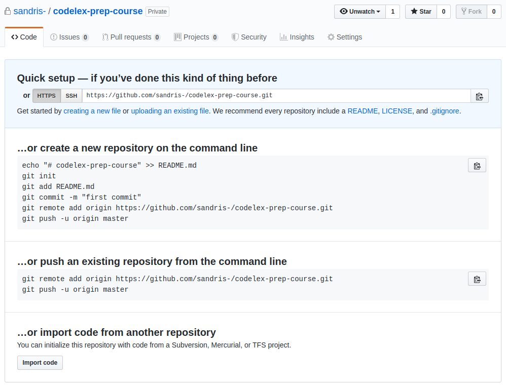
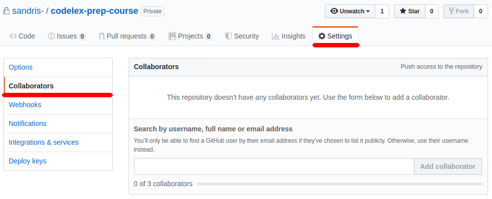

# Further Steps

## Show Your Progress

We would like to see your progress. Create a [github.com](https://github.com) account if you don't have any.

### Create Your Own [github.com](https://github.com) Repository

Just open [https://github.com/new](https://github.com/new) and create a new repository.

Let's call it `codelex-prep-course` and mark it a **private** (this step is very important, since we want achive an integrity). **DO NOT** check *Initialize this repository with a README* or add any other files, your repository must be completely empty.

This is how your repository must look.

### Add Collaborator To Your Repository

Since your repository is private - no one has access to it.

Go to settings and add **sandris-** as your project collaborator.

### Switch Your Project Remote

Now there are two remotes (think - two projects in the cloud):

 - [https://github.com/codelex-io/prep-course](https://github.com/codelex-io/prep-course)
 - [https://github.com/{your-username}/codelex-prep-course](https://github.com/{your-username}/codelex-prep-course)

To transfer everything to your repository you just need change remote.

If we would google `git change remote` we may stumble upon this [question @stackoverflow.com](https://stackoverflow.com/questions/2432764/how-to-change-the-uri-url-for-a-remote-git-repository).

Open terminal in your project directory and execute following commands:

 - `git remote set-url origin https://github.com/{your-username}/codelex-prep-course` switch remote to your repository
 - `git push` send all the changes to the repository
 - `git remote set-url origin https://github.com/codelex-io/prep-course` switch remote back to the original repository, if you would like to fetch latest changes for example

After you have successfully switched remote and pushed you should see all the changes in your repository.

## Train Your Brains [@codingame.com](https://www.codingame.com)

It is very important that you train your brains all the time.

For that reason, create an account [@codingame.com](https://www.codingame.com). In your profile, under school section, specify - **CODELEX**.

From the experience at groups, our recommendation is - five [clash of code](https://www.codingame.com/multiplayer/clashofcode) per day. But feel free to try other stuff there too.

If you want to compete with other potentional CODELEX students, type `/clash` in our slack channel and it will create a private clash of code.

As an alternative, continue to solve challenges [@hackerrank.com](https://www.hackerrank.com).

## Learn HTML

HTML is just too easy to teach in depth in person, so in addition to [HTML & CSS @khanacademy.org](https://www.khanacademy.org/computing/computer-programming/html-css) which you have completed already, go through these two courses as well.

 - [HTML & CSS @internetingishard.com](https://internetingishard.com/html-and-css/)
 - [Responsive Web Design Fundamentals @udacity.com](https://www.udacity.com/course/responsive-web-design-fundamentals--ud893)

## Admission

You will be evaluated based on your progress in the assignments above.