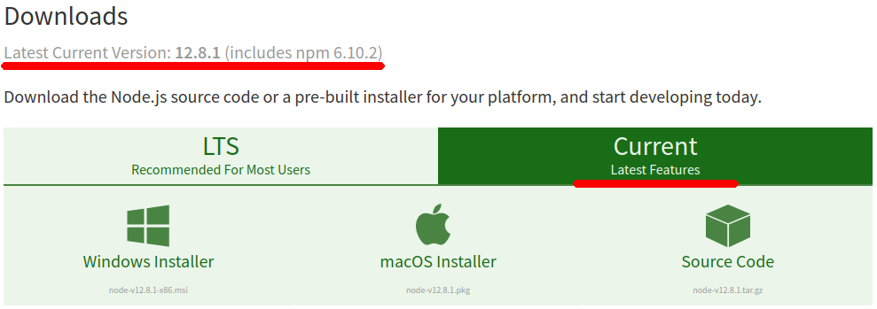
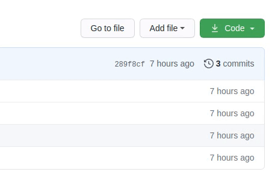
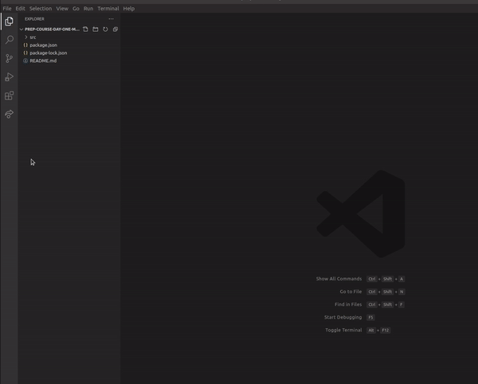

# Work Station Setup

## Visual Studio Code

We are going to use a code editor, which is pretty popular amongst developers. Download & install from [VSCode @code.visualstudio.com](https://code.visualstudio.com), after the installation make sure that everything works fine.

### Interested in learning more?

Check out [Get Started @code.visualstudio.com](https://code.visualstudio.com/docs/getstarted/introvideos)

## node & npm

> [Node.js®](https://nodejs.org) is a JavaScript runtime built on Chrome's V8 JavaScript engine. Node.js uses an event-driven, non-blocking I/O model that makes it lightweight and efficient.

To execute code written by you, we are going to use **node**, [download & install **LTS** version](https://nodejs.org/en/download)

Detailed instructions (don't pay attention to versions, these videos may be outdated):

- [Windows 7 / 8](https://www.youtube.com/watch?v=YL0Yk5GBxUE) & [Windows 10](https://www.youtube.com/watch?v=gHuIKptS0Qg)
- [Mac / Unix](https://www.youtube.com/watch?v=wREima9e6vk)

Since we are going to use superset of [JavaScript](https://developer.mozilla.org/en-US/docs/Web/JavaScript) - [TypeScript](https://www.typescriptlang.org/), install additional package [ts-node](https://www.npmjs.com/package/ts-node).

Simply execute these two commands:

- `npm install -g ts-node`
- `npm install -g typescript`

On Mac / Linux you may get following error - `Error: EACCES: permission denied error`, which means that you cannot install package globally using `-g` flag. To install package globally add `sudo` at the beginning of your command, so that `npm install -g ts-node` becomes `sudo npm install -g ts-node`.

### Verify

- check node version: `node -v`
- check npm version: `npm -v`
- execute code with ts-node: `ts-node -e "console.log('Hello, World!')"`

## Download and Open Project

Downloading code is easy, just go any repository and download code as `zip` file.

Extract it somwhere locally and open the folder in the VSCode.

